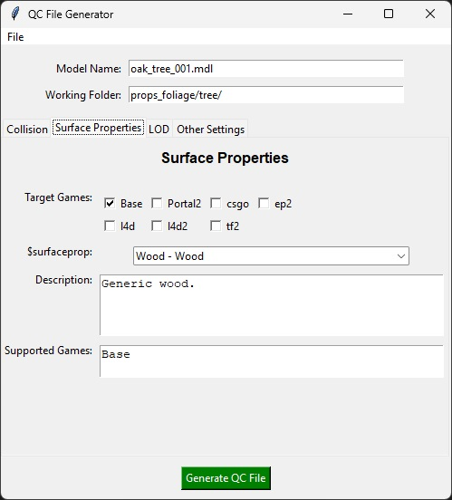

# QC File Generator

A GUI application to generate QC files for compiling models in the Source Engine. This tool allows you to easily create QC files by filling out forms and selecting options, without manually writing the QC code.

## Features

- **Surface Properties**: Select surface properties based on target games, with descriptions and supported games displayed.
- **Collision Settings**: Configure collision models, mass, and concavity options with tooltips providing helpful information.
- **Level of Detail (LOD)**: Add multiple LOD entries with screen sizes and corresponding models.
- **Other Settings**: Adjust scale, body name, static prop options, and shadow casting settings.
- **Tooltips**: Helpful tooltips are available for various fields to assist in configuring the QC file correctly.
- **File Generation**: Generates a QC file based on the provided inputs, ready for compiling with the model compiler.

## Photos


## Installation

### Prerequisites:

- Python 3.x installed on your system.

### Install Required Libraries:

```bash
pip install -r requirements.txt
```

## Usage

1.  Run the Application
    ```bash
    python main.py
    ```

2.  Load an SMD File
    - Go to File > Load SMD and select your SMD file.
    - The application will automatically populate the model name and infer material paths based on the selected SMD file.

3.  Fill in Model Details
    - Model Name: Specify the output name of the .mdl file.
    - Working Folder: Define where the model will be compiled to and where material references will point.

4.  Configure Tabs
    - Surface Properties Tab
        - Select the target games for your model.
        - Choose a surface property from the filtered list.
        - View the description and supported games for the selected surface property.
    
    - Collision Tab
        - Specify a collision model or use the main model.
        - Set the mass of the model.
        - Indicate if the collision model is concave.

    - LOD Tab
        - Add Level of Detail entries by specifying screen sizes and corresponding models.

    - Other Settings Tab
        - Adjust the body name and scale.
        - Set whether the prop is static and if it should cast shadows from texture alpha.

5. Generate the QC File
    - Click the Generate QC File button.
    - The QC file will be generated and saved in the same directory as your SMD file.
    - A success message will confirm the location of the generated QC file.